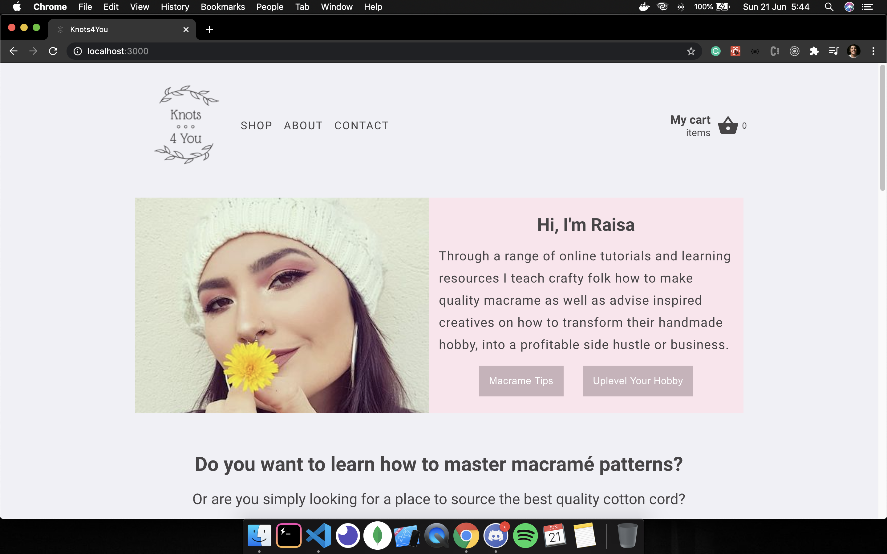
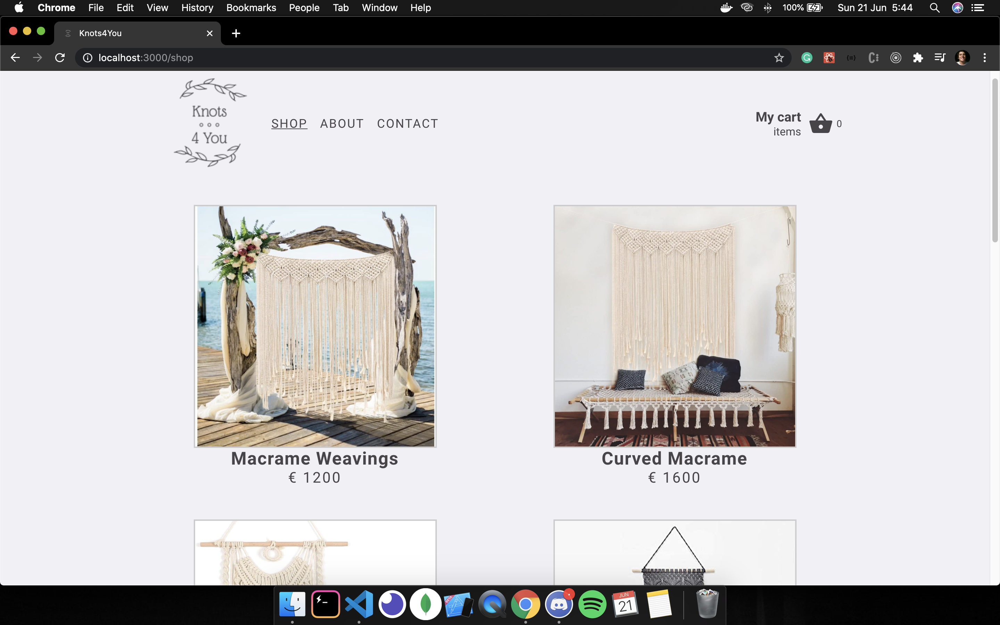
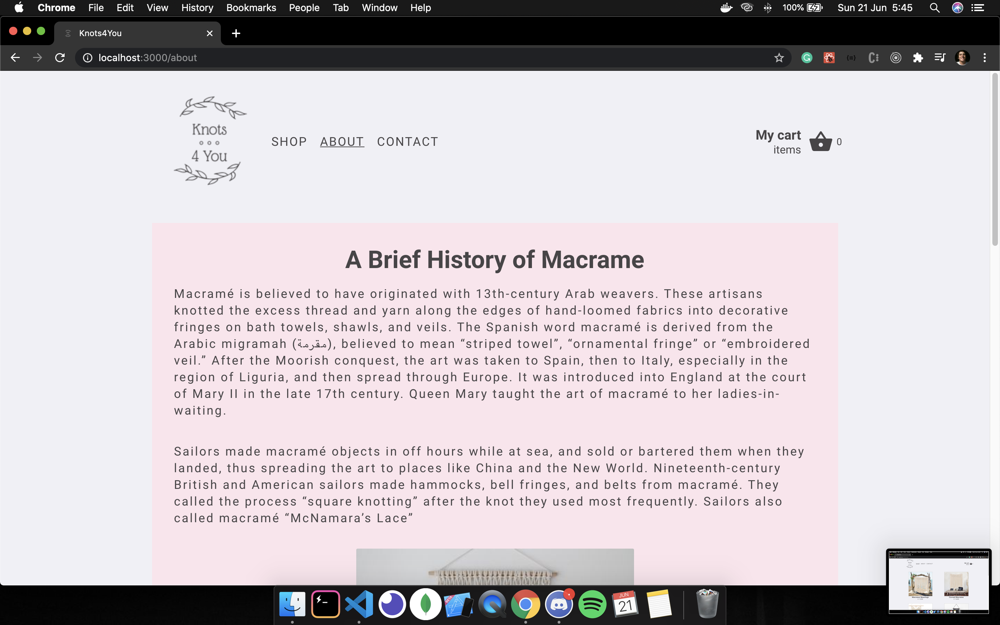
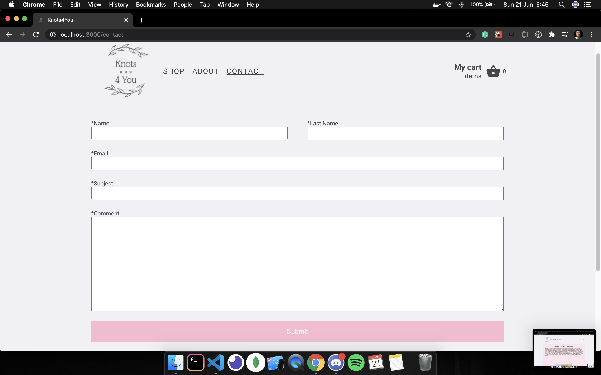
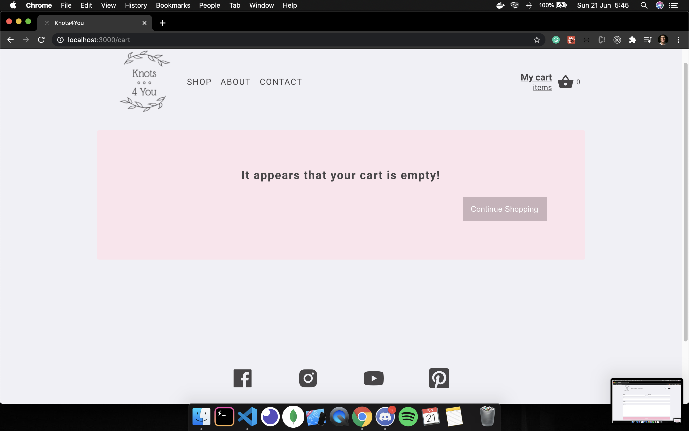
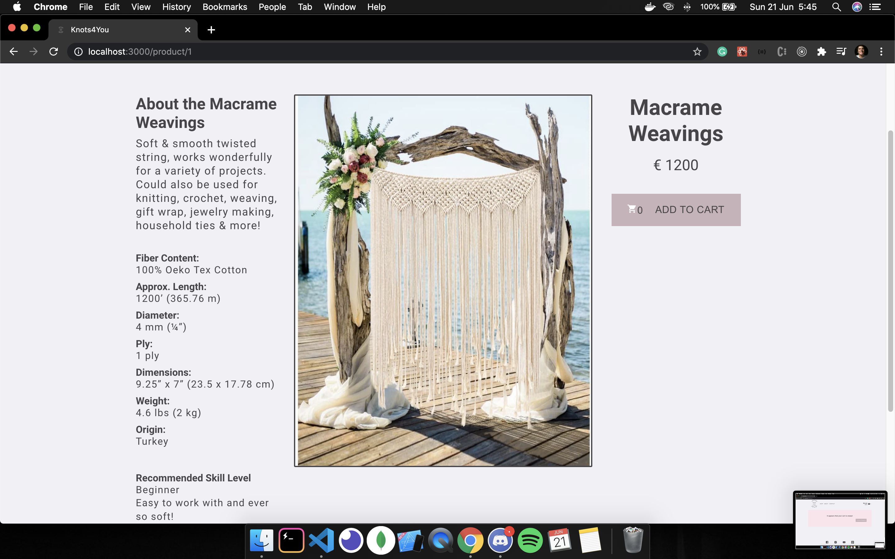
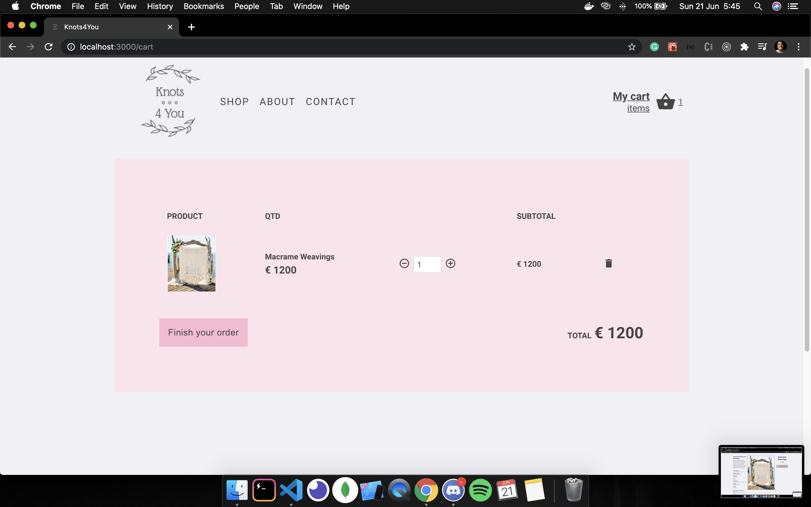

# Knots-4-You

This is the frontend of the **Knots-4-You** project.
This is a project where I could use many professional techniques that is used in "the real world".

## About the project

- The **Knots-4-You** is an e-commerce website.
- The website has a home page saying a few things about the website's owner and it gives some tips for those who are starting to work with macrame, the 'Shop' page where the **_user_** can see all the products for sale, the 'About' page where it says a brief history about the macrame, the 'Contact' page where the **_user_** can contact the website's owner, the 'Product' page where the **_user_** is send when he/she clicks in the product, before add to the cart and also the 'Cart' page where the user can see all the products that is added to the cart.

## The frontend

The frontend was developed with [**_React Hooks_**](https://reactjs.org/docs/hooks-intro.html) with [**_Redux-Saga_**](https://redux-saga.js.org/) using [**_axios_**](https://www.npmjs.com/package/axios) to request the [**_json-server_**](https://www.npmjs.com/package/json-server) API.
[**_react-router-dom_**](https://www.npmjs.com/package/react-router-dom) was used to handle the routes in this application.

**Home**

**Shop**

**About**

**Contact**

**Empty Cart**

**Product**

**Cart**

## Getting started

1.  Prerequisites

- npm

      npm install npm@latest -g

2. Installation

- Clone the repo

      git clone https://github.com/euguilhermegirardi/Knots-4-You

3. Install NPM packages

       npm install

4. Run the application

       json-server server.json -p 3333 
       npm run start

## Contributing

1.  Fork the project
2.  Create your feature branch (`git checkout -b feature/AmazingFeature`)
3.  Commit your changes (`git commit -m 'Add some AmazingFeature'`)
4.  Push to the branch (`git push origin feature/AmazingFeature`)
5.  Open a pull request

## License

